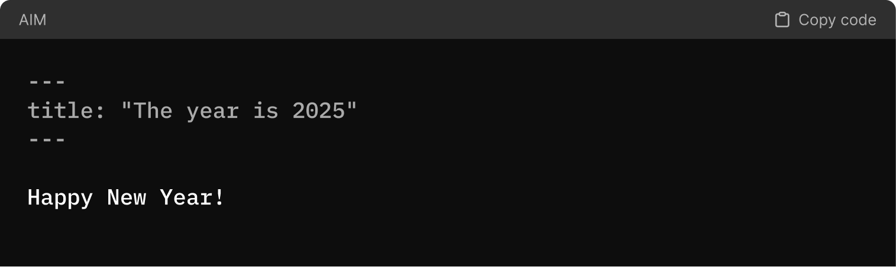
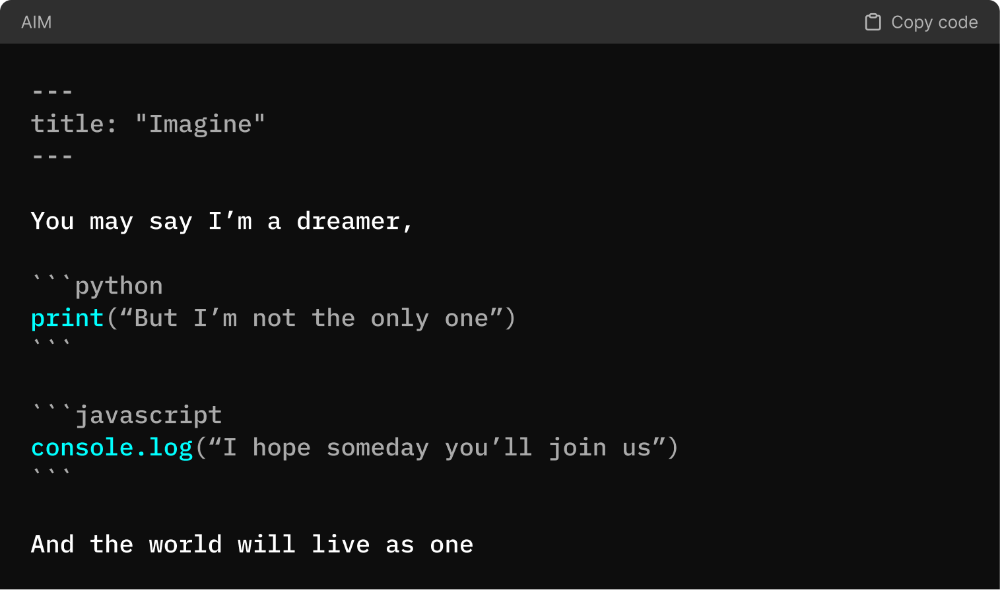
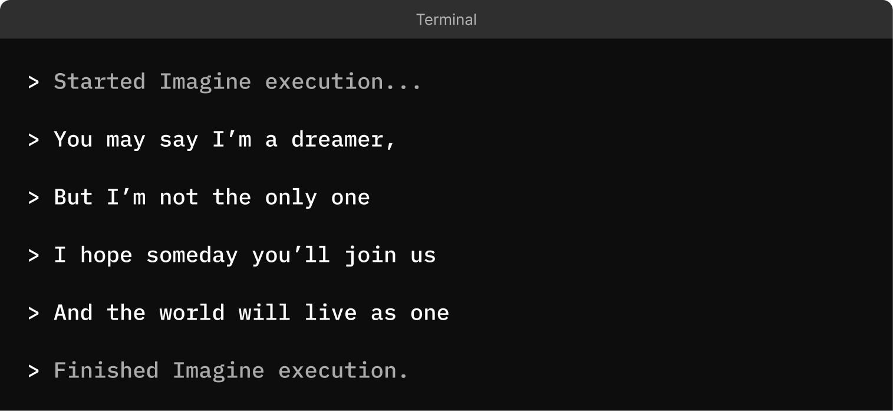

The landscape of software engineering has changed dramatically over the past few months. As we step into 2025, it’s clear that the tools, practices, and paradigms we once relied on are evolving.

<!-- truncate -->

After nearly three years of building with Large Language Models (LLMs), exploring various frameworks, and working with countless APIs, one thing has become crystal clear:

**The near future of software engineering is prompt-driven programming.**

In my opinion, Markdown, a language many of us already use to structure our thoughts and ideas, has emerged as a natural fit for this shift. With its clarity and accessibility, it serves as the perfect foundation for a system that turns ideas into execution.

### The AI Markup Language - AIM

AIM (AI Markup Language) builds on this simplicity. By integrating directives and intelligent constructs directly into Markdown, it transforms how we approach development—making it easier than ever to structure goals, define workflows, and leverage the power of AI.

The example below illustrates how AIM seamlessly integrates natural language with executable code. It allows us to mix prose, programming, and structured thought into a single, executable document.

In the first image, we see the AIM document, where natural language and multiple programming languages (Python and JavaScript) coexist in harmony. This highlights AIM’s ability to maintain clarity and execute contextually.

In the second part, the Terminal showcases the execution of the document. Each part of the input is processed:

- The prose is interpreted and displayed as natural text.
- The Python and JavaScript snippets are executed, with their outputs included as part of the terminal logs.

This example demonstrates the power of AIM as a tool for prompt-driven programming, where structured thoughts, code, and execution come together to create a seamless development experience.

Prompt-driven programming isn’t just a new concept—it’s a practical solution to the challenges of modern software engineering. AIM enables you to focus less on boilerplate setup and more on solving problems, iterating faster, and delivering impactful solutions.

---

I'll try to keep adding interactive examples to this blog post. Here's the first one:

import {CodePreview} from '@site/src/components/code-preview';

<CodePreview title="another-example.aim" example="dreamer"></CodePreview>

This example does not show the full power of AIM, but this is just the beginning. [Follow me on X](https://x.com/microchipgnu) to stay updated on the latest developments.