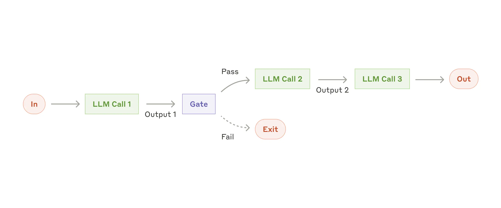

[Building effective agents](https://www.anthropic.com/research/building-effective-agents) by Anthropic goes over some of the different types of workflows that can be created with agents.

Today I want to show you some recipes that you can use to create your own agents.

## Prompt chaining

Prompt chaining decomposes a task into a sequence of steps, where each LLM call processes the output of the previous one. You can add programmatic checks (see "gate” in the diagram below) on any intermediate steps to ensure that the process is still on track.




This workflow is ideal for situations where the task can be easily and cleanly decomposed into fixed subtasks. The main goal is to trade off latency for higher accuracy, by making each LLM call an easier task.


```aim { title="Prompt Chaining" }

Sally earns $12 an hour for babysitting. Yesterday, she just did 50 minutes of babysitting. How much did she earn?






    Question: 

    



```

**Examples where prompt chaining is useful:**   

- Generating Marketing copy, then translating it into a different language.
- Writing an outline of a document, checking that the outline meets certain criteria, then writing the document based on the outline.

# Routing

Routing classifies an input and directs it to a specialized followup task. This workflow allows for separation of concerns, and building more specialized prompts. Without this workflow, optimizing for one kind of input can hurt performance on other inputs.


**When to use this workflow:** Routing works well for complex tasks where there are distinct categories that are better handled separately, and where classification can be handled accurately, either by an LLM or a more traditional classification model/algorithm.

