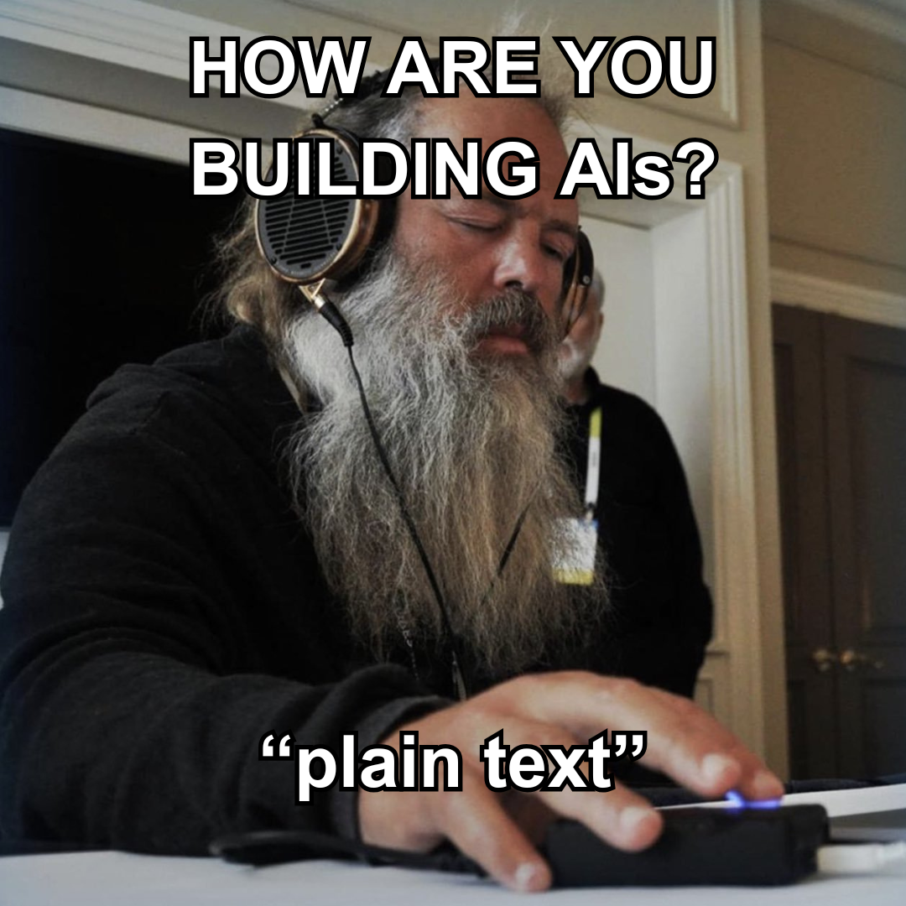
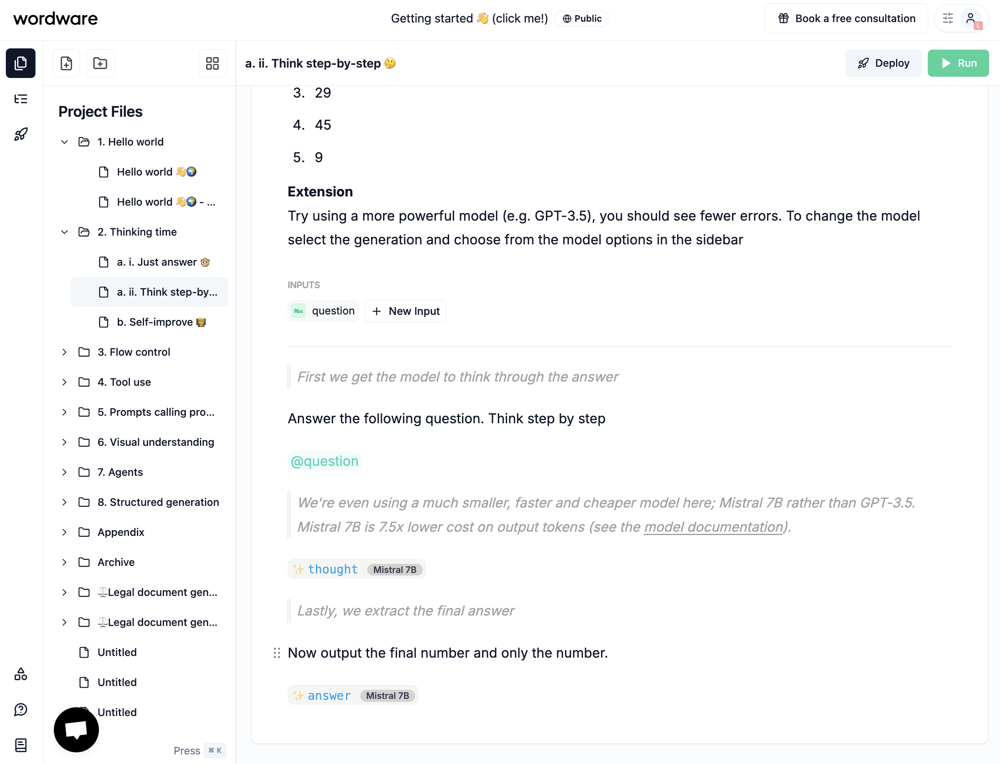
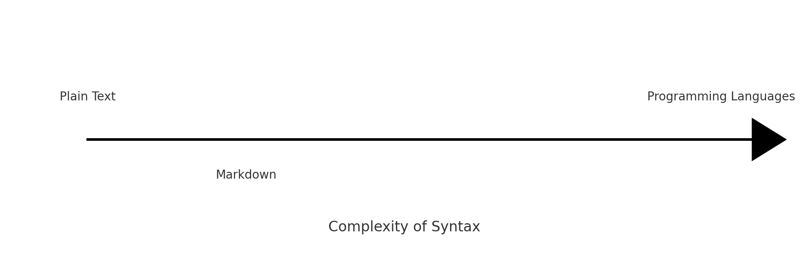
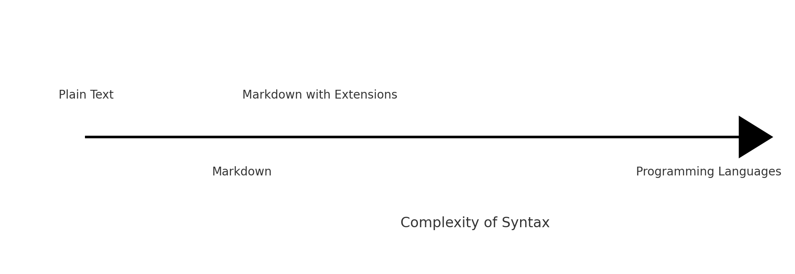

Ten days went by since my [last update](/blog/welcome) when I briefly introduced AIM as a potential solution for a new type of programming. On this post, I'll be exploring the different types of syntax I've been exploring and the decisions I've made.

It was intentional to not show you the syntax until now because I wanted to make sure I had a good grasp of the different options.

Ever since I started my journey as an engineer, I think I've been attracted to the idea of simplifying things for the end user, even if it means sacrificing some of the flexibility or hacking things to make it work.

## Simple in principle

From the start, I wanted to make sure AIM was **easy to use** and **understand**. My vision for it was to make it a productive tool to write software on the go, from my mobile phone on my Notes application to having a solution that works -- this might be a bit of a stretch, but I'm sure you get the point.



I don't know exactly when but I know I woke up one day tired of coding. I was tired of how all things are so complex and time consuming, while I'm mostly passionate about the idea of solving problems. This is particularly true when it comes to using AI to solve problems.

I decided to just make a language that my core system could interpret so I would not have to deal with all the complexity every time. 

Then one night while in Kuala Lumpur (Malaysia) around November 2024, I realized that this could be done in a way that integrates with the existing ecosystem of tools and languages and that's when I started to think about how to make this happen.


## State of Generative Coding in 2025

There are several options for having an AI co-worker helping you craft software today. You have [Bolt](https://bolt.new), [v0](https://v0.dev) and Lovable as standalone products, or you have Cursor and the multiple IDE options that integrate with LLMs and achieve the same thing.

The reality is that programming now involves less and less code writing, but more selecting parts of the text, tagging others and prompting the system with your requests. If that fails or you think it's quite there, you prompt it again until it does.

You even have new things like Devin and others that run fully autonomous, integrate with your team's codebase and chatting platforms like Slack.

Most of this involve lots of prompting. prompting is just a little note you send to the system to get it to do something, whether that's fixing something it has done before or just asking it to make something for you.

If prompts are a cumulation of notes taken as we evaluate the work being done by an AI system then I want to build software while taking notes.

And I think there's value in building a prompting-oriented language that can operate entire software solutions. Software as a note (SaaN) lol

And if we're building software like taking notes, we need to have a flexible and simple syntax to make it simple while also separating very clearly what's code and what's text.

## Wordware and Natural Language Programming

While I was researching information on this topic I stumbled upon [Wordware](https://wordware.ai).

Wordware builds on this idea of sotware as prompts. The team as built a web app that lets users write code in natural language in a Notion-like interface. Each Wordapp -- a wordware program -- is a collection of prompts that can be run on the web app or on the server, so effectively when you build a wordware program, you're building a cross-platform application.



Although I loved the idea of wordware I could not overlook the fact that it's a proprietary product, that it's somewhat closed and I really wanted to author my files anywhere. [File over app](https://stephango.com/file-over-app)


> "Perfection is achieved not when there is nothing more to add, but when there is nothing left to take away." - Antoine de Saint-Exupéry

Software programming is just a way to express ideas, instructions and concepts in a way that can be understood by a computer. It's means to an end, and the end is to solve problems.

Problems!

Are software developers the only people who can solve problems? No, generally speaking, they are problably very good at solving computer problems, but not so much at solving societal problems. 

Software developers are translators of a problem they where given by someone (or them) and they solve that problem with computer instructions.

Problem solving is a team effort, and so should be the software development process.

## Markdown

I will just say that the ideal format for writing a solution is to write it down in natural language. 

"do this, do that, do the other thing"

And that's it, the computer interprets it and does it. This is what prompt-driven development is all about.

But as we are building bigger solutions relying on agentic workflows, we need to make them reproducible, evaluable and testable. And we need versioning, collaboration and all that.

We can problem build a system that allows us to write in natural language and then convert it to code. And that's what many people are banking on. I will have a contrarian opinion for once, and say that I think it's still a bit too early for that -- at least at a certain level of scale and complexity, this won't just cut it.

Also I think that a solution that allows us to write in natural language, or close to it, needs to acommodate the idea that more people (less technically minded) will be starting to cooperate with developers to achieve solutions together.

Just text is probably not ideal. We need a bit more structure and control. We probably need to find a syntax that allows to structure text without losing the natural language aspect.

And this is where I think Markdown comes in.

If I were to place Markdown in a two-dimensional graph comparing it to other ways to express program solutions, it would be something like this:



Markdown was built to be simple and readable while allowing for structure.

There are other Markup languages, but it seems that the general consensus is that Markdown is the best option for keeping things simple and readable. I compared Markdown to other Markup languages to see how it compares. 


import { useState } from 'react';

<div>
  {(() => {
    const [isOpen, setIsOpen] = useState(false);
    
    return (
      <div style={{ marginBottom: '1rem' }}>
        <button
          onClick={() => setIsOpen(!isOpen)}
          style={{
            background: 'none',
            border: '1px solid #ccc',
            padding: '0.5rem 1rem',
            cursor: 'pointer',
            display: 'flex',
            alignItems: 'center',
            gap: '0.5rem',
            width: '100%',
            justifyContent: 'center'
          }}
        >
          <span style={{ transform: `rotate(${isOpen ? '90deg' : '0deg'})`, transition: 'transform 0.2s' }}>
            ▶
          </span>
          Click to expand comparison table
        </button>
        <div
          style={{
            maxHeight: isOpen ? '1000px' : '0',
            overflow: 'hidden',
            transition: 'max-height 0.3s ease-in-out',
          }}
        >
          <div style={{ padding: '1rem 0' }}>
            <table>
              <thead>
                <tr>
                  <th>Feature</th>
                  <th>Markdown</th>
                  <th>HTML</th>
                  <th>LaTeX</th>
                  <th>Asciidoc</th>
                  <th>BBCode</th>
                  <th>reStructuredText</th>
                  <th>Textile</th>
                </tr>
              </thead>
              <tbody>
                <tr>
                  <td>Simplicity</td>
                  <td>Highly simple and intuitive</td>
                  <td>Verbose and complex</td>
                  <td>Complex for beginners</td>
                  <td>Moderately simple</td>
                  <td>Simple but limited</td>
                  <td>Slightly complex</td>
                  <td>Moderately simple</td>
                </tr>
                <tr>
                  <td>Learning Curve</td>
                  <td>Very easy to learn</td>
                  <td>Steeper learning curve</td>
                  <td>Very steep learning curve</td>
                  <td>Moderate learning curve</td>
                  <td>Very easy to learn</td>
                  <td>Moderate learning curve</td>
                  <td>Easy to moderate</td>
                </tr>
                <tr>
                  <td>Customization</td>
                  <td>Customizable via extensions</td>
                  <td>Highly customizable but complex</td>
                  <td>Extremely customizable</td>
                  <td>Customizable with better structure</td>
                  <td>Limited customization</td>
                  <td>Highly customizable</td>
                  <td>Customizable with extensions</td>
                </tr>
                <tr>
                  <td>Readability</td>
                  <td>Highly readable as plain text</td>
                  <td>Readable but cluttered</td>
                  <td>Readable only for experts</td>
                  <td>Readable but slightly less than Markdown</td>
                  <td>Readable for simple tasks</td>
                  <td>Readable but verbose</td>
                  <td>Highly readable</td>
                </tr>
                <tr>
                  <td>Tooling/Support</td>
                  <td>Excellent support with many tools</td>
                  <td>Good support but less tooling</td>
                  <td>Niche tooling, not beginner-friendly</td>
                  <td>Good support but fewer tools than Markdown</td>
                  <td>Decent support</td>
                  <td>Good support, popular in Python</td>
                  <td>Decent but less popular</td>
                </tr>
                <tr>
                  <td>Performance</td>
                  <td>Lightweight and fast</td>
                  <td>Efficient but more resource-heavy</td>
                  <td>Can be resource-heavy</td>
                  <td>Efficient but less used</td>
                  <td>Lightweight</td>
                  <td>Lightweight and efficient</td>
                  <td>Lightweight and fast</td>
                </tr>
                <tr>
                  <td>Popularity</td>
                  <td>Very popular and widely adopted</td>
                  <td>Popular but less user-friendly</td>
                  <td>Popular in academia</td>
                  <td>Limited popularity</td>
                  <td>Common in forums</td>
                  <td>Popular in Python documentation</td>
                  <td>Niche community</td>
                </tr>
              </tbody>
            </table>
          </div>
        </div>
      </div>
    );
  })()}
</div>

Markdown ticked all the boxes for me and of course I have been using it for more than a decade.


But while Markdown is simple and readable, it also makes it difficult to add rich content to it.

There are several options to add rich content to Markdown, like MDX, but in reality I was just enabling the ability to add javascript to it, and not rethinking the model of how to express program solutions.

Back to the drawing board.

This is where I started learning more about the different ways to extend Markdown.

1. Directives proposal https://talk.commonmark.org/t/generic-directives-plugins-syntax/444
2. Markdoc https://markdoc.io/
3. Remark ecosystem https://github.com/remarkjs/remark/blob/main/doc/plugins.md#list-of-plugins

At first the directives seemed simple enough. Lets think of a simple program to get inference from an LLM and then output its result.

```markdown
give me the different options for the syntax

::ai{#decisions model=”openai/o1”}

$decisions
```

But I quickly realized that it would be difficult to have a syntax that would be easy to understand and use.

Nested directives would look really messy.

```markdown
:::::container
::::container2
:::container3
::ai{#decisions model=”openai/o1”}
:::
::::
:::::
```

Then one day I was reading a blog post about Markdown's syntax decisions by [Gruber](https://daringfireball.net/linked/2022/05/19/markdoc)

> Markdoc is Stripe’s own content authoring system, implementing a rich superset of Markdown, and released this week as an open source project. It looks wonderful. I love their syntax extensions — very true to the spirit of Markdown. They use curly braces for their extensions; I’m not sure I ever made this clear, publicly, but I avoided using curly braces in Markdown itself — even though they are very tempting characters — to unofficially reserve them for implementation-specific extensions. Markdoc’s extensive use of curly braces for its syntax is exactly the sort of thing I was thinking about.

This was the confirmation I needed and I spent about two or three days reading their docs and thinking about it.


```aim

  
    
      
    
  


```

> Markdoc was designed to decouple code and content while enforcing proper discipline at the boundaries
 




```aim
---
title: "Decisions, Decisions"
---

Explain the decisions made for AIM's syntax





```

1. Wordware
2. Why Markdown?
3. First pass on syntax directives etc etc
4. Stripe blog post: https://stripe.com/blog/markdoc
5. https://daringfireball.net/linked/2022/05/19/markdoc
6. AIM vs JS iamge comparison
7. Markdown helps style the output while making it possible to run it in client facing applications and servers
8. Integrating into the growing gen code with ai, means that having a simple syntax costs less and makes it even easier to use, while achieving powerful results
9. reproducilble prompts
10. tool compatibility