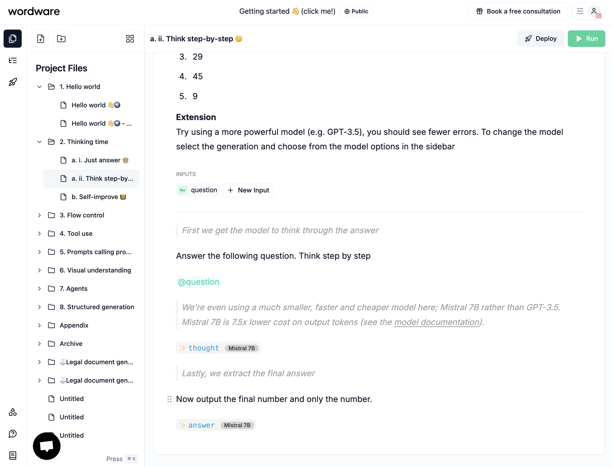
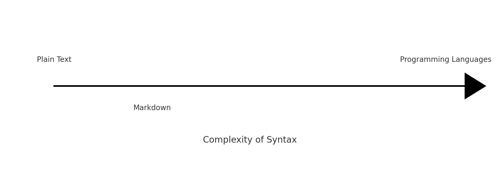

Twelve days have passed since my [last update](/blog/welcome), where I briefly introduced AIM. In this post, I’ll walk you through the different syntax options I’ve been exploring and the decisions I’ve made along the way.


I intentionally held off on showing any concrete syntax until now because I wanted to ensure I had a solid grasp of the possibilities. Ever since I started my engineering journey, I’ve been drawn to the idea of simplifying things for end users—even if that means sacrificing some flexibility or hacking together a workaround. That’s how I operate: simplicity over complexity whenever possible.

> *Perfection is achieved not when there is nothing more to add, but when there is nothing left to take away.*
> 
> **Antoine de Saint-Exupéry**


## Simple at Heart

From day one, my vision for AIM was that it should be **easy to use** and **understand**. Ideally, I want it to be a tool that’s productive enough to write software on the go -- from my Notes app on a phone, for example, all the way to an actual working solution. Maybe that’s a stretch, but I hope you see where I’m coming from.

I’m not entirely sure when it happened, but I woke up one morning just exhausted by coding. Everything felt so time-consuming and overcomplicated -- while my true passion is solving problems, not wrestling with boilerplate. This is particularly relevant when we’re using AI to solve problems.


> "*How are you building your AIs?*"
>
> "*Plain text*"

So, I decided to build a language and a system to interpret it. That way, I wouldn’t have to deal with all the usual complexity every single time. And more importantly, I could have full control over the whole language and how I wanted it to work.

Then one night in Kuala Lumpur around late November 2024, I was looking at the city from above and I started thinking that a new language should integrate gracefully with the whole programming tools and ecosystems. That’s where the spark came from -- the idea of making it play nicely with the infrastructure we already rely on.


## State of Generative Coding in 2025

Generative coding in 2025 is a bit of a mess. There are several ways to have an AI co-pilot your software development:

- [Bolt](https://bolt.new), [v0](https://v0.dev), and Lovable operate as standalone products.
- Cursor and various IDE solutions integrate with LLMs to achieve similar functionality.
- Devin (and others like it) run fully autonomously, tying into your team’s codebase and communication platforms like Slack.

Programming has become less about cranking out lines of code and more about prompting. You select text, label it, and ask the system to do something. If it’s off, you keep prompting until it gets closer to what you need.

That’s where tools like Devin come in: they automate a lot of the process and let you collaborate in real time with AI. But it all boils down to prompts -- small notes you send to the AI to fix or create something.

To me, prompts are basically **notes** reflecting our thought process as we evaluate AI’s work. If that’s how we’re building software, then I want to do it in a note-taking style. This is why I see value in a **prompting-oriented language** for building entire solutions.

And if we’re building software like we’re taking notes, we need a straightforward, flexible syntax -- one that separates code from text in a super clear way.

## Natural Language Programming

During my research, I came across [Wordware](https://wordware.ai), which emphasizes the idea of software as prompts. They have a web app that lets you write code in natural language, Notion-style. Each “wordapp” (their term) is a collection of prompts that run in either the browser or on a server. Effectively, when you build a wordapp, you’re building a cross-platform application.

I love the concept, but Wordware itself is proprietary and relatively closed. I really wanted something that I could author anywhere, in a simple file-based setup rather than being tied to a single web app.




Software programming is simply a way to express ideas, instructions, and concepts in a format the computer understands. It’s a means to the end goal—solving problems.

**Problems!**

Are software developers the only people who can solve problems? Of course not. They’re good at solving computer problems, but in many cases, they are given problems by people who don’t know how to solve them. 

Developers are basically translators. They take a problem from someone (or themselves) and break it down into computer instructions. But problem-solving is a team effort, so software development should be too.

## Markdown

In an ideal scenario, you’d just say:

"Do this, do that, do the other thing"

And the computer would interpret it and make it happen. That’s essentially prompt-driven development.

But if we’re building bigger systems with agentic workflows, we need reproducibility, testability, version control, collaboration. Sure, we can write in pure natural language and convert that to code, but in my opinion, it’s a bit early for large-scale, complex projects to rely solely on that approach.

On top of that, we need to accommodate less-technical collaborators in our workflows, bridging the gap between them and traditional developers. Plain text isn’t ideal for all scenarios. We need a bit more structure and a way to differentiate between instructions and normal language.

This is where Markdown shines. It’s simple, easy to read, and supports just enough structure.

Markdown has been around forever, and I’ve personally used it for more than a decade. It’s widely regarded as the best option for keeping documents both simple and readable.

If I were to compare Markdown to other languages vs plain text, I think Markdown leans more towards plain text.



Markdown was built to be simple and readable while allowing for structure.

There are other Markup languages, but it seems that the general consensus is that Markdown is the best option for keeping things simple and readable. I compared Markdown to other Markup languages to see how it compares. 


import { useState } from 'react';

<div>
  {(() => {
    const [isOpen, setIsOpen] = useState(false);
    
    return (
      <div style={{ marginBottom: '1rem' }}>
        <button
          onClick={() => setIsOpen(!isOpen)}
          style={{
            background: 'none',
            border: '1px solid #ccc',
            padding: '0.5rem 1rem',
            cursor: 'pointer',
            display: 'flex',
            alignItems: 'center',
            gap: '0.5rem',
            width: '100%',
            justifyContent: 'center'
          }}
        >
          <span style={{ transform: `rotate(${isOpen ? '90deg' : '0deg'})`, transition: 'transform 0.2s' }}>
            ▶
          </span>
          Click to expand comparison table
        </button>
        <div
          style={{
            maxHeight: isOpen ? '1000px' : '0',
            overflow: 'hidden',
            transition: 'max-height 0.3s ease-in-out',
          }}
        >
          <div style={{ padding: '1rem 0' }}>
            <table>
              <thead>
                <tr>
                  <th>Feature</th>
                  <th>Markdown</th>
                  <th>HTML</th>
                  <th>LaTeX</th>
                  <th>Asciidoc</th>
                  <th>BBCode</th>
                  <th>reStructuredText</th>
                  <th>Textile</th>
                </tr>
              </thead>
              <tbody>
                <tr>
                  <td>Simplicity</td>
                  <td>Highly simple and intuitive</td>
                  <td>Verbose and complex</td>
                  <td>Complex for beginners</td>
                  <td>Moderately simple</td>
                  <td>Simple but limited</td>
                  <td>Slightly complex</td>
                  <td>Moderately simple</td>
                </tr>
                <tr>
                  <td>Learning Curve</td>
                  <td>Very easy to learn</td>
                  <td>Steeper learning curve</td>
                  <td>Very steep learning curve</td>
                  <td>Moderate learning curve</td>
                  <td>Very easy to learn</td>
                  <td>Moderate learning curve</td>
                  <td>Easy to moderate</td>
                </tr>
                <tr>
                  <td>Customization</td>
                  <td>Customizable via extensions</td>
                  <td>Highly customizable but complex</td>
                  <td>Extremely customizable</td>
                  <td>Customizable with better structure</td>
                  <td>Limited customization</td>
                  <td>Highly customizable</td>
                  <td>Customizable with extensions</td>
                </tr>
                <tr>
                  <td>Readability</td>
                  <td>Highly readable as plain text</td>
                  <td>Readable but cluttered</td>
                  <td>Readable only for experts</td>
                  <td>Readable but slightly less than Markdown</td>
                  <td>Readable for simple tasks</td>
                  <td>Readable but verbose</td>
                  <td>Highly readable</td>
                </tr>
                <tr>
                  <td>Tooling/Support</td>
                  <td>Excellent support with many tools</td>
                  <td>Good support but less tooling</td>
                  <td>Niche tooling, not beginner-friendly</td>
                  <td>Good support but fewer tools than Markdown</td>
                  <td>Decent support</td>
                  <td>Good support, popular in Python</td>
                  <td>Decent but less popular</td>
                </tr>
                <tr>
                  <td>Performance</td>
                  <td>Lightweight and fast</td>
                  <td>Efficient but more resource-heavy</td>
                  <td>Can be resource-heavy</td>
                  <td>Efficient but less used</td>
                  <td>Lightweight</td>
                  <td>Lightweight and efficient</td>
                  <td>Lightweight and fast</td>
                </tr>
                <tr>
                  <td>Popularity</td>
                  <td>Very popular and widely adopted</td>
                  <td>Popular but less user-friendly</td>
                  <td>Popular in academia</td>
                  <td>Limited popularity</td>
                  <td>Common in forums</td>
                  <td>Popular in Python documentation</td>
                  <td>Niche community</td>
                </tr>
              </tbody>
            </table>
          </div>
        </div>
      </div>
    );
  })()}
</div>

Markdown ticked all the boxes for me and of course I have been using it for more than a decade. But while Markdown is simple and readable, it also makes it difficult to add rich content to it.


The downside? Adding rich, interactive content to Markdown can be tricky. Tools like MDX let you inject JavaScript, but they don’t fundamentally rethink how to express program logic.

## Back to the Drawing Board

Once I decided that Markdown was a strong starting point, I looked into different ways to extend it:

1. [**Directives Proposal** ](https://talk.commonmark.org/t/generic-directives-plugins-syntax/444)
2. [**Remark Ecosystem**](https://github.com/remarkjs/remark/blob/main/doc/plugins.md#list-of-plugins)
3. [**Markdoc**](https://markdoc.io/)

At first, I tried to use directives for something straightforward -- like querying an LLM and outputting the result. 

```markdown
give me the different options for the syntax

::ai{#decisions model=”openai/o1”}

$decisions
```

It seemed intuitive until I realized how messy it gets when you start nesting directives:

```markdown
:::::container
::::container2
:::container3
::ai{#decisions model=”openai/o1”}
:::
::::
:::::
```

Then I stumbled across a blog post by [Gruber](https://daringfireball.net/linked/2022/05/19/markdoc) discussing some of Markdown’s original syntax decisions. It reminded me that we should keep it simple, or risk losing the very things that make Markdown so pleasant in the first place.


> Markdoc is Stripe’s own content authoring system, implementing a rich superset of Markdown, and released this week as an open source project. It looks wonderful. I love their syntax extensions — very true to the spirit of Markdown. They use curly braces for their extensions; I’m not sure I ever made this clear, publicly, but I avoided using curly braces in Markdown itself — even though they are very tempting characters — to unofficially reserve them for implementation-specific extensions. Markdoc’s extensive use of curly braces for its syntax is exactly the sort of thing I was thinking about.

Reading that post reaffirmed the direction I was heading in. I spent the next few days pouring over Markdoc’s documentation and thinking about how it enforces structure and separation between code and content:


```aim

  
    
      
    
  


```

[Markdoc was designed to decouple code and content while enforcing proper discipline at the boundaries, as read in the Stripe Engineering Blog](https://stripe.com/blog/markdoc).

It seemed to echo my own goals: keep Markdown at the core, but allow for a richer set of directives or “nodes” when we really need them. This is where I would place AIM's Markdown flavour (based on Markdoc) now.


Now let's see how AIM compares to JavaScript in a practical example. Both achieve the same result, but notice how AIM's declarative syntax eliminates boilerplate and lets you focus purely on describing what you want to accomplish.

import Tabs from '@theme/Tabs';
import TabItem from '@theme/TabItem';

<Tabs>
  <TabItem value="aim" label="AIM" default>
```aim
---
input:
  - name: string
    description: "Name of the person"
  - details: string 
    description: "Details about the person"
---

Research this person: 
Details: 





Write a copy to convince them to use Natural Language for AI Agents.





Write a poem about them and why using AIM makes sense.





```
  </TabItem>
  <TabItem value="js" label="JavaScript">

```js

const { PromptTemplate, LLMChain } = require('langchain');
const { OpenAI } = require('langchain/llms/openai');
const { Claude } = require('langchain/llms/claude');
const { Sonar } = require('langchain/llms/sonar');

// Initialize the LLMs
const llmSonar = new Sonar({ modelName: 'perplexity-sonar' }); // Using Sonar for research
const llmClaude = new Claude({
  modelName: 'claude-sonnet-3.5',
  useStructuredGenerations: true, // Using Claude's Sonnet 3.5 with structured generations
});
const llmOpenAI = new OpenAI({
  modelName: 'text-davinci-003',
  temperature: 0.7, // Using OpenAI's GPT model for the poem
});

// Define the templates
const researchPrompt = new PromptTemplate({
  inputVariables: ['name', 'details'],
  template: `
Research this person: {name}
Details: {details}
[research]
`,
});

const benefitsPrompt = new PromptTemplate({
  inputVariables: ['name'],
  template: `
Now, write a copy to personally convince {name} to start using Natural Language to create their AI Agents utilizing a product called Wordware.
Underline the benefits of using AI to automate their work.
[benefits]
`,
});

const poemPrompt = new PromptTemplate({
  inputVariables: ['name'],
  template: `
Write a poem which will underline how amazing {name} is and why using a product like Wordware makes sense for them.
[poem]
`,
});

// Example usage
async function generateOutputs() {
  const researchChain = new LLMChain({ llm: llmSonar, prompt: researchPrompt });
  const benefitsChain = new LLMChain({
    llm: llmClaude,
    prompt: benefitsPrompt,
  });
  const poemChain = new LLMChain({ llm: llmOpenAI, prompt: poemPrompt });

  // Example inputs
  const inputs = {
    name: 'John Doe',
    details: 'Tech entrepreneur focused on AI tools',
  };

  const researchOutput = await researchChain.run(inputs);
  const benefitsOutput = await benefitsChain.run({ name: inputs.name });
  const poemOutput = await poemChain.run({ name: inputs.name });

  console.log('Research Output:', researchOutput);
  console.log('Benefits Output:', benefitsOutput);
  console.log('Poem Output:', poemOutput);
}

generateOutputs();
```
  </TabItem>
</Tabs>


Both snippets achieve the same goal—researching a person, writing persuasive copy, and generating a poem. However, the AIM version provides a more declarative approach, letting you focus on what needs to be done rather than how to implement it. The JavaScript example, while familiar to many developers, requires additional imports, function calls, and boilerplate to orchestrate the AI workflows.

By streamlining these tasks into a file-first format and handling AI prompts natively, AIM cuts down on the overhead code and token usage. In this example, JavaScript weighs in at 510 tokens, while AIM comes in at just 138 tokens—nearly a 3.7x improvement in terms of verbosity. That leaner footprint translates to lower costs and a faster route to building dynamic, AI-driven solutions.

Moreover, AIM’s syntax is easier to extend and maintain as your project grows. Rather than scattering prompt templates across multiple files or frameworks, you keep all logic in one concise place. 

## Final Thoughts

By reducing boilerplate and making it easier to connect to an LLM, you streamline development and make the solution more accessible and modular. Every solution should boil down to a file—or a collection of files—written in a format as close to natural language as possible.

1. Lower barries to entry - non-technical users can use it and easily create solutions
2. Simplicity and future-proofing - You can swap LLMs without fuss, and you are not locked into any single app
3. Enduring value -- As [Kepano](https://stephango.com/file-over-app) says "the files you create are more important than the tools you use to create them", so it's best to keep them in an open, portable format.

LLMs are fast becoming the "CPUs" of moderns problem-solving, and file-first approach safeguards us from ever being trapped by today's software platforms. Beyond that, this approach naturally lends itself to "coding agents" because:

1. LLMs produce text in Markdown, which already enhances readibility, formatting and structure.
2. It cuts down token usage significantly -- sometimes by up to 3x -- making the resulting AI-driven solutions both more efficient and const-effective.


But the biggest reason for me is **empowering humans**. We want people to stay in control of how they solve problems, using **their own natural language** without fear of vendor lock-in. I'm convinced that there's practically infinite demand for software, and AIM should let everyone contribute without being stuck in a single platform's ecosystem.


<!-- 1. Wordware
2. Why Markdown?
3. First pass on syntax directives etc etc
4. Stripe blog post: https://stripe.com/blog/markdoc
5. https://daringfireball.net/linked/2022/05/19/markdoc
6. AIM vs JS iamge comparison
7. Markdown helps style the output while making it possible to run it in client facing applications and servers
8. Integrating into the growing gen code with ai, means that having a simple syntax costs less and makes it even easier to use, while achieving powerful results
9. reproducilble prompts
10. tool compatibility -->